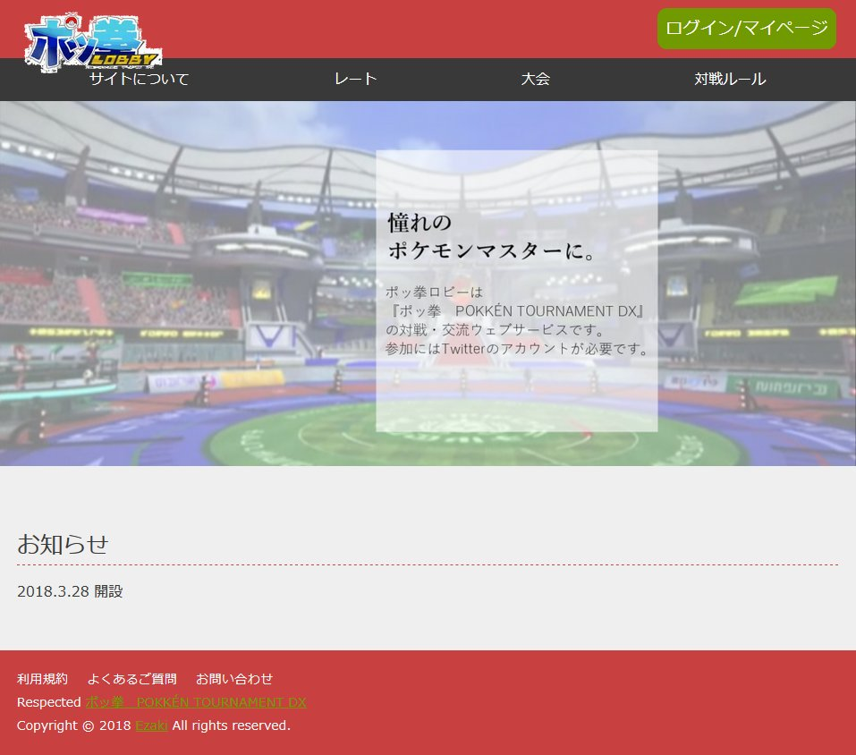
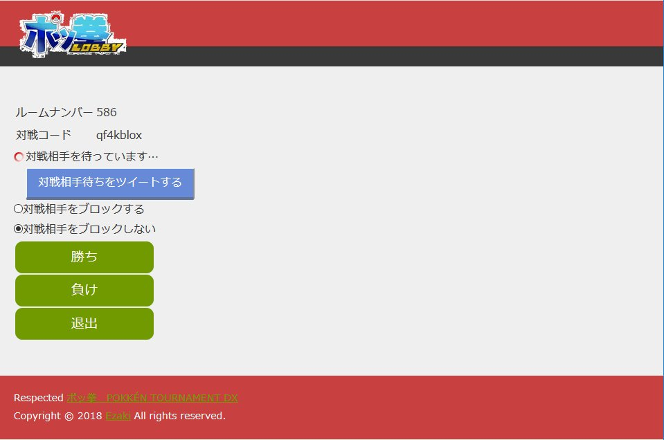
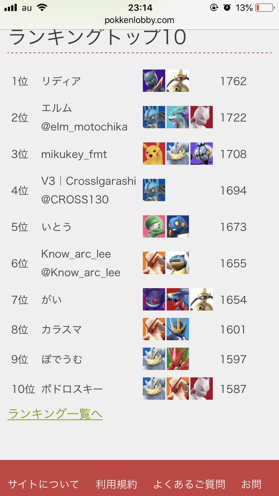

# PokkenLobby

## 概要

Webサービス「ポッ拳ロビー」のソースコード。
2018/4/3のものをgithubに残しておく。ただしconfig.phpは編集している。

## ナイスポイント

### Twitterログインを実装している

ドットインストールを参考にして実装した。

### commetを用いて対戦成立した際告知するようにした

がんばればチャット機能もPHPで実装できそう。
こういったリアルタイム通信を真剣に実装するならnode.jsの方がよさそう。

## だめポイント

### ソースコード

ぐちゃぐちゃで保守性のかけらもない。

### マッチングの適当さ

同時オンライン人数も高々30人くらいのサービスだったのでうまくいったがもう少しちゃんと実装した方がいい。

## スクリーンショット

